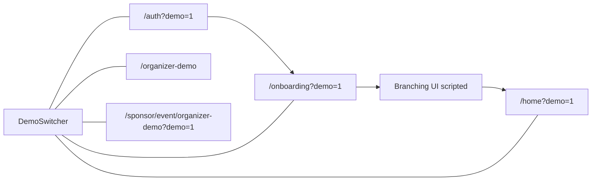

# Why the plan looked “missing”

Cursor saved the first plan under your **global** plans folder (`~/.cursor/plans/unified_demo_mode_cafb2661.plan.md`) with `isProject: false`, so it **does not appear inside the intro-mvp repo**. This copy lives in the project at `.cursor/plans/unified-demo-mode.md` so it shows up with the workspace.

---

# Unified general demo mode

## URL flag

Use **`?demo=1`** everywhere for attendee demo state. Propagate it on internal links.

Helpers: `src/lib/demo-mode.ts` — `useDemoMode()`, `demoHref(path)`.

## Entry points

| Step | URL | Notes |
|------|-----|--------|
| Auth | `/auth?demo=1` | Real auth page; handlers short-circuit to onboarding (no Supabase). |
| Onboarding | `/onboarding?demo=1` | Same `NewOnboardingFlow` + `EventBranchingOnboarding` UI; no persistence; branching uses **scripted client** flow (your choice). |
| Matches | `/home?demo=1` | Already in `src/components/home/home-page.tsx`. |
| Organizer | `/organizer-demo` | Existing. |
| Sponsor | `/sponsor/event/organizer-demo?demo=1` | Page already supports demo; layout must allow unauthenticated access when demo. |

## Sponsor layout and `searchParams`

`layout.tsx` in the App Router **does not receive `searchParams`**, so “read `?demo=1` in the sponsor layout” is not reliable on its own.

**Approach:** add `src/middleware.ts` that matches `/sponsor/:path*` and, when `request.nextUrl.searchParams.get("demo") === "1"`, clones the request with header `x-intro-demo: 1` (or sets a short-lived cookie). `src/app/sponsor/layout.tsx` then uses `headers().get("x-intro-demo")` and skips `redirect("/auth")` when set.

## Floating switcher

New `src/components/demo/demo-switcher.tsx` — client, collapsible rail on the right:

- **Attendee** → `/auth?demo=1` (optional secondary: Skip to matches → `/home?demo=1`)
- **Organizer** → `/organizer-demo`
- **Sponsor** → `/sponsor/event/organizer-demo?demo=1`
- **Exit demo** → strip `demo` or go to `/auth`

Mount from `src/app/layout.tsx`; render only when `?demo=1` **or** path starts with `/organizer-demo`.

## Auth (`auth-form.tsx`)

If `demo=1`, every sign-in path `router.push("/onboarding?demo=1")`. Small “Demo mode” label.

## Onboarding (`new-onboarding-flow.tsx`)

When demo:

- Fake user aligned with `DEMO_USER` in `src/lib/home-demo-data.ts`.
- Force `eventId` / name consistent with demo (`ORGANIZER_DEMO_EVENT_ID` from `src/lib/organizer-demo-data.ts` and the same narrative as home demo event name).
- Skip profile upsert, avatar upload, company-enrich network calls.
- After branching `onComplete`, `router.push("/home?demo=1")`.

## Branching (`event-branching-onboarding.tsx`)

`demo` prop: when true, drive phases from `src/lib/onboarding/demo-script.ts` instead of `fetch("/api/onboarding/...")`. Same card shell and controls.

## Files touched (summary)

- Add: `src/lib/demo-mode.ts`, `src/lib/onboarding/demo-script.ts`, `src/components/demo/demo-switcher.tsx`, `src/middleware.ts`
- Edit: `src/components/auth/auth-form.tsx`, `src/components/onboarding/new-onboarding-flow.tsx`, `src/components/onboarding/event-branching-onboarding.tsx`, `src/app/sponsor/layout.tsx`, `src/app/layout.tsx`
- Optional: trim duplicate links in `src/app/organizer-demo/layout.tsx` if the rail replaces them.

## Flow (reference)

When you want this **implemented in code**, say explicitly to execute the plan (e.g. “go ahead and implement”).
