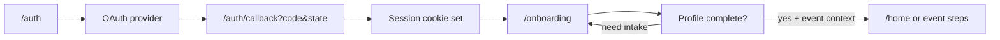

# App vs marketing routing (eventintroductions.com)

This document is the **source of truth** for what URL shows **marketing** vs the **Next.js app**, and where users go **after sign-in**.

## Quick reference: paths

| URL pattern | What the user sees | Notes |
|-------------|-------------------|--------|
| `/` | Marketing (`public/marketing/index.html`) via `next.config.ts` **beforeFiles** rewrite | Unless **proxy** or the inline script in that HTML redirects (OAuth / logged-in). |
| `/how-it-works`, `/your-sponsors`, `/your-attendees`, `/pricing`, `/contact` | Same marketing HTML | Same rewrite target. |
| `/auth` | App: sign-in / sign-up (`AuthForm`) | Entry for email, Google, LinkedIn. |
| `/auth/callback` | App: OAuth code exchange → redirect | **Must** receive `?code=` from the IdP so the session cookie is set. |
| `/onboarding` | App: profile + event onboarding | After OAuth, callback sends users here; `NewOnboardingFlow` may forward to `/home`, `/event/join`, etc. |
| `/home` | App: main event experience | Matches, QR, directory. |
| `/join/[encrypted]` | App: encrypted event link router | Sends unauthenticated users to `/auth?code=…`. |
| `/event/join` | App: legacy 6-digit join UI | |
| `/messages`, `/profile/…`, `/settings`, `/survey/…`, `/admin/…`, `/organizer/…` | App | See `ROUTE_AUDIT.md` for detail. |

### Organizer (`/organizer`) — Phase B, read-only

**Who can access:** Signed-in users who appear in **`event_organizers`** for that event, or in **`organizer_memberships`** for an **`organizations.organization_id`** that matches the event’s **`events.organization_id`**. Migration: [`supabase/migrations/20260408_phase_b_organizer_access.sql`](supabase/migrations/20260408_phase_b_organizer_access.sql). Logic: [`src/lib/organizer-auth.ts`](src/lib/organizer-auth.ts).

**URLs:** [`/organizer`](src/app/organizer/page.tsx) lists allowed events; [`/organizer/event/[eventId]`](src/app/organizer/event/[eventId]/page.tsx) shows attendee roster, match summaries, and `system_match` pairs (no writes, no CRM).

**APIs:** [`src/app/api/organizer/`](src/app/api/organizer/) — all `GET`, session required, service role only after an event-scoped check.

**Assigning access (SQL examples):**

```sql
-- Per-event organizer (user must exist in public.users)
insert into public.event_organizers (event_id, user_id)
values ('<event_uuid>', '<user_uuid>');

-- Or org-wide: link user to org, and set events.organization_id to that org
insert into public.organizer_memberships (user_id, organization_id, role)
values ('<user_uuid>', '<organization_uuid>', 'owner');
```

### Platform admin (`/admin`)

**Who can access:** Only users allowed by **`PLATFORM_ADMIN_USER_IDS`** (comma-separated Supabase auth UUIDs in env) or a row in the **`platform_admins`** table (see migration `supabase/migrations/20260407_phase_a_platform_admin.sql`). [`src/app/admin/layout.tsx`](src/app/admin/layout.tsx) redirects everyone else to `/home`; unauthenticated users go to `/auth`.

**APIs gated the same way:** [`/api/create-event`](src/app/api/create-event/route.ts), [`/api/update-event`](src/app/api/update-event/route.ts), [`/api/admin-start-matching`](src/app/api/admin-start-matching/route.ts), [`/api/admin-send-networking-cards`](src/app/api/admin-send-networking-cards/route.ts), read-only [`/api/platform-admin/event-health`](src/app/api/platform-admin/event-health/route.ts), and [`/api/platform-admin/event-organizers`](src/app/api/platform-admin/event-organizers/route.ts) (assign **portal organizers** for `/organizer`) require a logged-in platform admin session before using the service role.

From **`/admin/event/[eventId]`**, use the **Organizer portal** card to pick an **attendee** and grant access (writes `event_organizers`). People who have never joined the event still need a manual SQL/Table Editor row.

## Intended flow after “Sign in”



1. User opens **`/auth`** (e.g. [eventintroductions.com/auth](https://www.eventintroductions.com/auth)).
2. OAuth **`redirectTo`** should be **`{origin}/auth/callback`** (see `auth-form.tsx`).
3. **`/auth/callback`** exchanges `code` for a session, then redirects to **`/onboarding`** (see `auth/callback/route.ts`).
4. **`/onboarding`** loads profile state and routes to **`/home`**, **`/event/join`**, or event-specific steps as needed.

**Email/password** sign-in stays inside the app URLs above (no stop at `/` for the exchange).

## Why sign-in sometimes showed marketing at `/`

- Supabase **Site URL** is often the bare origin (`https://www.eventintroductions.com`). Some IdPs return users to **`/?code=…&state=…`** instead of **`/auth/callback`**, or only `/` is allow-listed.

- **`/`** is rewritten to **static marketing HTML**, which **does not** run Next’s route handler for OAuth. The `code` was never exchanged, so the user looked “logged out” on the homepage.

## Fixes in this repo (defense in depth)

1. **`src/proxy.ts` (Next.js 16+)**  
   - If request is **`/`** and query looks like OAuth (`state` or UUID-like `code`), **302 to `/auth/callback`** with the same query string.  
   - If user is **already authenticated** and hits **`/`**, **302 to `/onboarding`** (preserving non-OAuth `code` / `eventCode` for invites).

2. **`public/marketing/index.html` (inline script)**  
   - Same OAuth detection: **`location.replace('/auth/callback' + search)`**.  
   - If **Supabase auth cookies** are present on `/`, **`location.replace('/onboarding' + search)`** so a session never “sticks” on marketing.

3. **Supabase dashboard (you still need this)**  
   - **Redirect URLs** must include **`https://www.eventintroductions.com/auth/callback`**.  
   - For local dev, add each origin you use, e.g. **`http://localhost:1000/auth/callback`** (or whatever port you run: `npm run dev:1000`). If the callback URL is not allow-listed, Supabase sends users to **Site URL** (often `https://www.eventintroductions.com/`) with `?code=…` on **`/`** — marketing, not the app.

4. **Local vs production URL**  
   - OAuth `redirectTo` uses **`window.location.origin`** (not `NEXT_PUBLIC_APP_URL`) so starting at e.g. `http://localhost:1000/auth` always returns to **`http://localhost:1000/auth/callback`**. Keep `NEXT_PUBLIC_APP_URL` for emails/QRs; it no longer overrides OAuth return.

## Event invite persistence (not server DB)

Encrypted / legacy event hints are merged into **`localStorage`** via `pending-event-invite.ts` so **OAuth `?code=`** never collides with **invite** `code` (see `mergeInviteFromUrl` at `/auth`, `/join/...`, onboarding, home).

## Further detail

- **`ROUTE_AUDIT.md`** — per-route data reads/writes and API summary.
